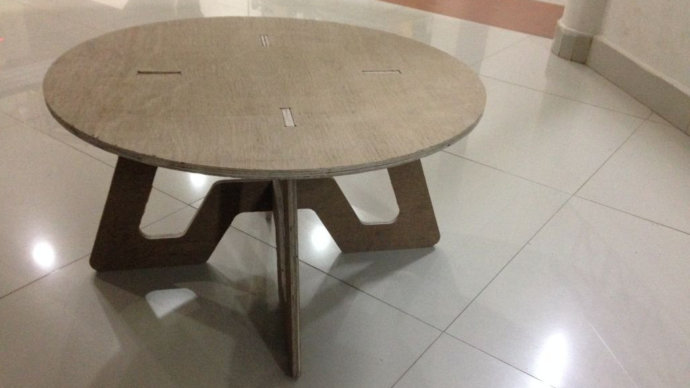
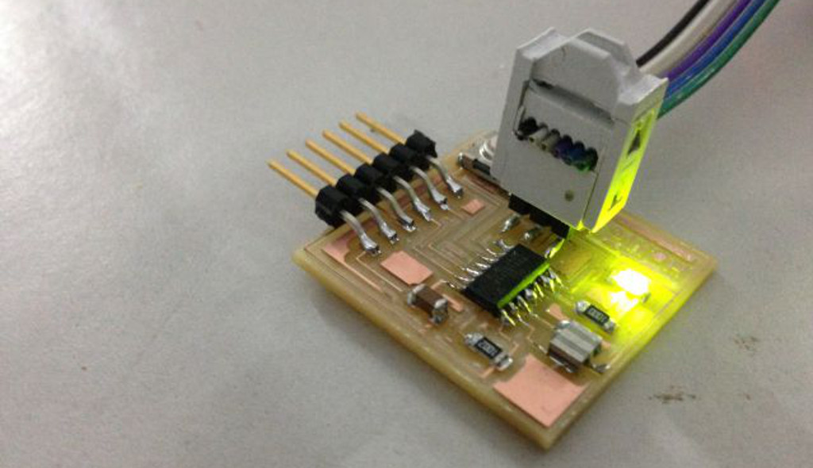

[][FabAcademy]

   This is my journey through <a href="http://archive.fabacademy.org/archives/2016/master/">Fab Academy 2016</a> at
   <a href="https://www.fablabs.io/fablabtrivandrum">FabLab Trivandrum, India</a>.

 

<h2 style="text-align:center">What is Fab Academy?</h2>

   Fab Academy is an intensive 20-week course in digital fabrication... <a href="fabacademy.html">read more</a>.

 

<h2 style="text-align:center">Assignments</h2>

<table cellspacing="10" cellpadding="10">
<tr>
   <td style="text-align:right" width="30%">
      <a href="w1-principles.html">Principles & Practices</a>  
      Week 1 (Jan 27th)
   </td>
   <td>
      
   </td>
</tr>
<tr>
   <td style="text-align:right">
      <a href="w2-cad.html">Computer-Aided Design</a>  
      Week 2 (Feb 3)
   </td>
   <td>
      <a href="w2-cad.html">
         &nbsp;
         
         &nbsp;
      </a>
   </td>
</tr>
<tr>
   <td style="text-align:right">
      <a href="w3-cutting.html">Computer-Controlled Cutting</a>  
      Week 3 (Feb 10)
   </td>
   <td>
      <a href="w3-cutting.html">
         &nbsp;
         &nbsp;
         
      </a>
   </td>
</tr>
<tr>
   <td style="text-align:right">
         <a href="w4-eprod.html">Electronics Production</a>  
		Week 4 (Feb 17)
	</td>
	<td> 
	    <a href="w4-eprod.html">
			&nbsp;
			&nbsp;
		</a> 
   </td> 
</tr> 
<tr>
   <td style="text-align:right">
         <a href="w5-3d.html">3D Printing & Scanning</a>  
		Week 5 (Feb 24)
	</td>
	<td> 
          
	</td> 
</tr> 
<tr>
   <td style="text-align:right">
         <a href="w6-edesign.html">Electronics design</a>   
		Week 6 (Mar 2)
   </td>	
   <td> 
      <a href="w6-edesign.html">
		&nbsp;
		&nbsp;
		
	  </a> 
   </td> 
</tr> 
<tr>
   <td style="text-align:right">
         <a href="w7-machining.html">Computer-controlled machining </a>   
		Week 7 (Mar 9)
	</td>
	<td> 
       
    </td> 
</tr> 
<tr>
   <td style="text-align:right">
	<a href="w8-embedded.html">Embedded programming</a>   
		Week 8 (Mar 16)
	</td>
	<td> 
		 
   </td> 
</tr> 
<tr>
   <td style="text-align:right">
		Mechanical design, machine design  
		Week 9 (Mar 23)
	</td>
	    <td> 
	   </td> 
</tr> 
<tr>
   <td style="text-align:right">
		Break  
		Week 10 (Mar 30)
	</td>
	    <td> 
	   </td> 
</tr> 
<tr>
   <td style="text-align:right">
		Machine presentations  
		Week 11 (Apr 6)
	</td>
	    <td> 
	   </td> 
</tr> 
<tr>
   <td style="text-align:right">
		Input devices  
		Week 12 (Apr 13)
	</td>
	    <td> 
	   </td> 
</tr> 
<tr>
   <td style="text-align:right">
		Molding and casting  
		Week 13 (Apr 20)
	</td>
	    <td> 
	   </td> 
</tr> 
<tr>
   <td style="text-align:right">
		Output devices  
		Week 14 (Apr 27)
	</td>
	    <td> 
	   </td> 
</tr> 
<tr>
   <td style="text-align:right">
		Composites  
		Week 15 (May 4)
	</td>
	    <td> 
	   </td> 
</tr> 
<tr>
   <td style="text-align:right">
		Networking and communications  
		Week 16 (May 11)
	</td>
	    <td> 
	   </td> 
</tr> 
<tr>
   <td style="text-align:right">
		Interface and application programming  
		Week 17 (May 18)
	</td>
	    <td> 
	   </td> 
</tr> 
<tr>
   <td style="text-align:right">
		Applications and implications  
		Week 18 (May 25)
	</td>
	    <td> 
	   </td> 
</tr> 
<tr>
   <td style="text-align:right">
		Invention, intellectual property, and income  
		Week 19 (Jun 1)
	</td>
	    <td> 
	   </td> 
</tr> 
<tr>
   <td style="text-align:right">
		Project development  
		Week 20 (Jun 8)
	</td>
	    <td> 
	   </td> 
</tr> 
</table>

[FabAcademy]: http://fabacademy.org
[FabLabs]: http://archive.fabacademy.org/archives/2016/master/labs.html
[HTMAA]: http://fab.cba.mit.edu/classes/863.14/
[ProfNeil]: http://ng.cba.mit.edu/
[CBA]: http://cba.mit.edu/
[FabAcademy2016]: http://archive.fabacademy.org/archives/2016/master/
[Schedule]: http://archive.fabacademy.org/archives/2016/master/schedule.html
[2015Projects]: http://fabacademy.org/archives/2015/students/index.html
[SolidConTalk]: https://www.youtube.com/watch?v=L0RDrSKenGo
[EdgeInterview]: https://edge.org/conversation/neil_gershenfeld-digital-reality
[FabBook]: https://books.google.co.in/books?id=Zw0j50HDwYUC&lpg=PP1&pg=PP9#v=onepage&q&f=false
