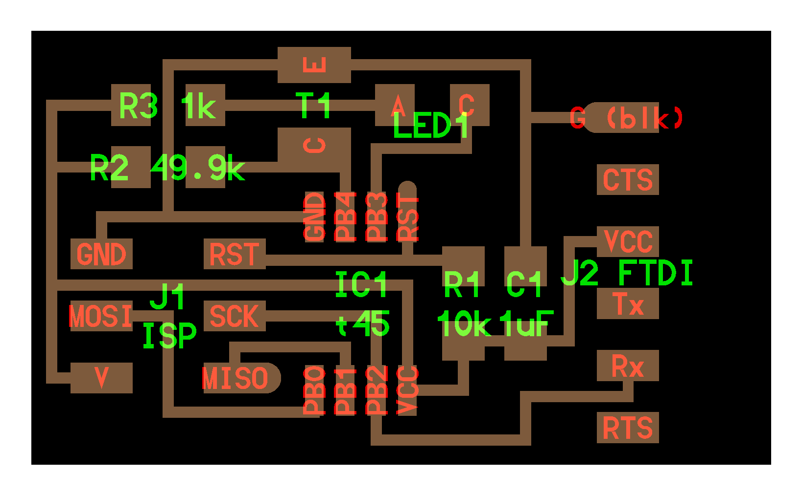
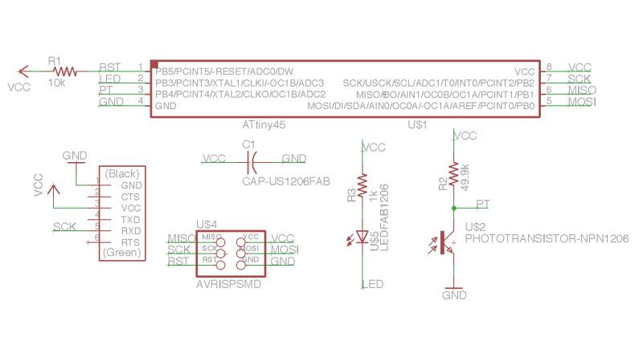
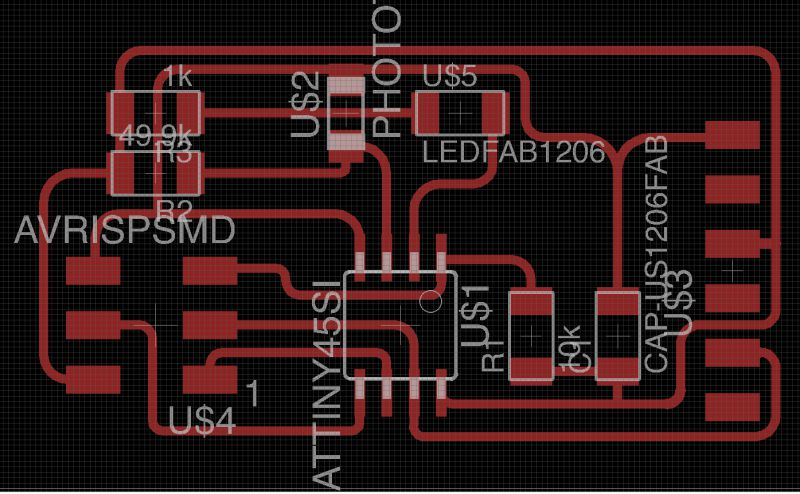

[Class Notes](http://academy.cba.mit.edu/classes/input_devices/index.html)

## Assignment

> measure something: add a sensor to a microcontroller board that you have designed and read it

## Planning

I reviewed [Neil's lecture](https://vimeo.com/162721990) and started making a list of sensors that seemed interesting:
 
* Ambient light sensor: useful for my [final project](w1-principles.html)
* Motion sensor: useful for my final project
* Step response: for its versatility
* Video: because I'm interested in gesture recognition

## Ambient Light Sensor

I decided to take this up first, since it would be used in my final clock project to detect ambient light and turn off
the display when its completely dark.

This uses a phototransistor, specifically this [one](http://www.digikey.com/product-detail/en/tt-electronics-optek-technology/OP580DA/365-1481-1-ND/1853400). 

Here is Neil's board layout:

Neil also demonstrates a technique called synchronous detection, which allows you to differentiate a reflected light (which 
  you control) from ambient light. I could use this for simple gesture recognition in the clock. 
   
Here is the light reflect board, it adds an LED and a resistor to the previous board. 

I'm going to make the reflect board, because it could possibly allow me to use a simple LED instead of Infrared emitter / sensor to detect
    hand movements.

### Drawing the board in Eagle

First step is to draw the schematics in Eagle.

Looking at the board above, I'm not sure why the RX pin (instead of the TX pin) of the FTDI connector is connected to PB2. 
This might be to not require swapping of TX / RX jumper cables.

Some questions to revisit:

* How is the capacitor value calculated to be 1µf?
* Why is R2 so high at 49.9K ohms? 

Here is the schematic:

and here is the layout:

Here are the original files:

* Schematic: [w12-reflect.sch](files/w12-reflect.sch)
* Board: [w12-reflect.brd](files/w12-reflect.brd)
 
### Cutting it in the Modella

### Stuffing the board

### Programming it