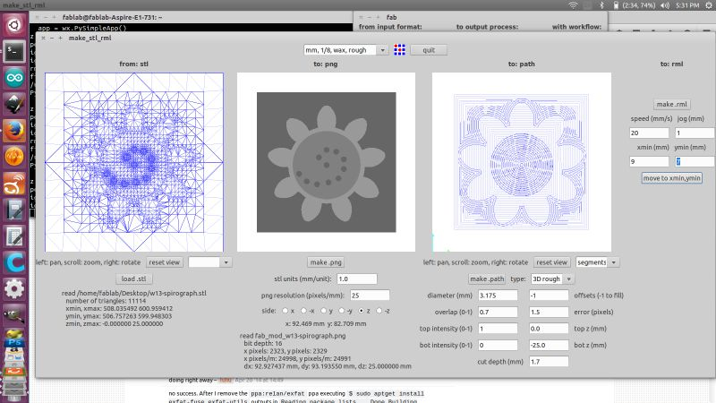
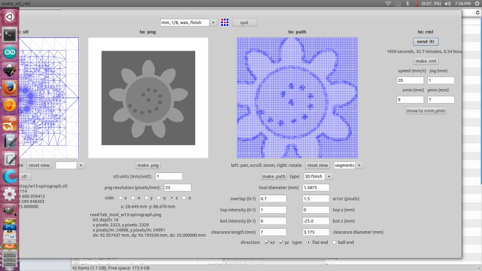

[Class Notes](http://academy.cba.mit.edu/classes/molding_casting/index.html)   
[Lecture Video](https://vimeo.com/163576093)

## Assignment

> design a 3D mold, machine it, and cast parts from it

I've decided to do a simple object first in order to get familiar with the workflow, which is completely new to me. These are the steps:
 
* create 3D model, ideally in a tool which supports boolean operations, like Antimony or OpenSCAD.
* export an STL file, convert to PNG, generate toolpath using fabmodules
* mill it using the Modella out of machineable wax 
    * rough cut
    * finishing cut
* create a silicone mold
* cast a piece using DryStone

---

I'm making a [spirograph](http://www.thingiverse.com/thing:905849), which can be used to create interesting designs.

I used Rhino to create a 3D model:

---

Next, I designed the silicone mold for it by subtracting the above design from a cuboid.  

---

Then I designed the wax mold for the silicone mold, by subtracting the above from a bigger cuboid. This 
    positive -> negative -> positive thinking definitely takes some time to get used to!

---

I wanted to do a test run, so I created a mold only for the gear:

---

These are the settings in fabmodules for the rough-cut with a 1/8th inch flat-nose end-mill:

---

These are the settings for the finishing-cut with a 1/16th inch end-mill:

---

Here is the mold after the rough cut, notice that the holes weren't cut:

---

Here is the mold after the finishing cut with the holes cut out too:

Original Files:

*  Rhino 3DM file and STL file: [spirograph.zip](files/spirograph.zip))