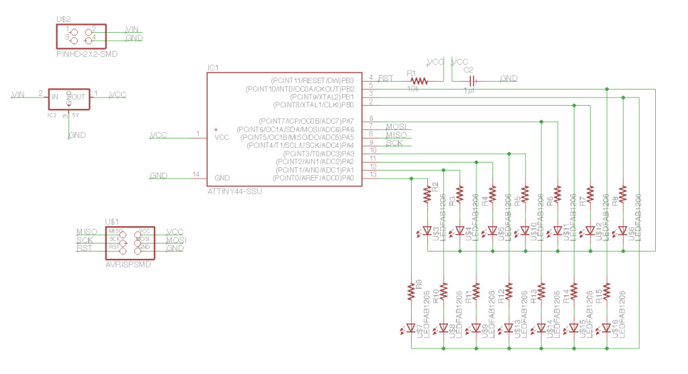
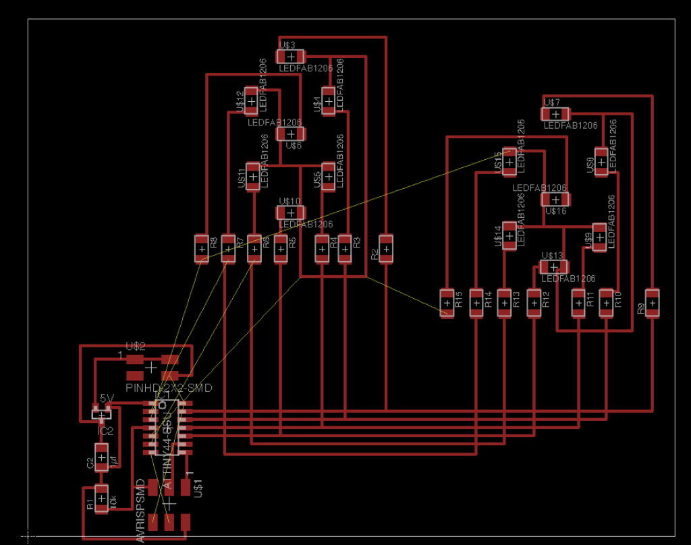
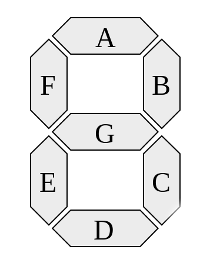
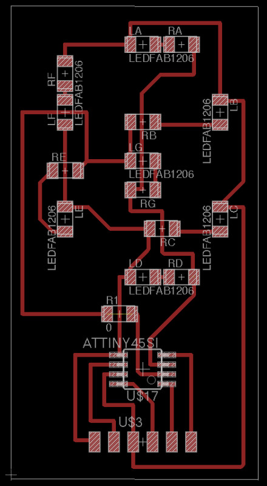
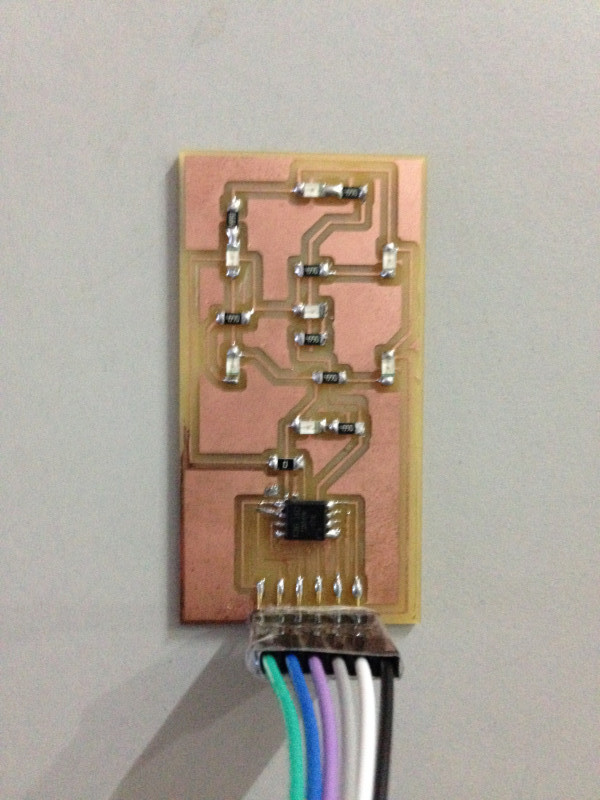

[Class Notes](http://academy.cba.mit.edu/classes/output_devices/index.html)   
[Lecture Video](https://vimeo.com/164447297)

## Assignment

> add an output device to a microcontroller board you've designed and program it to do something

### Charlieplexed 7-segment LED digits

For this assignment I decided to make a 7-segment display with at least 2 digits, since this would come handy for my 
 final clock project.
 
I spent some time going deeper into electronics, particularly understanding inductors, impedance, semi-conductors, and 
    power-supplies. This site - [Learn About Electronics](learnabout-electronics.org) had excellent explanations e.g. check out 
    the section on [Filter Circuits](http://www.learnabout-electronics.org/PSU/psu12.php), it explains the role of reservoir 
    filters very well. I also referred to classics like [Art of Electronics](http://www.amazon.com/Art-Electronics-Paul-Horowitz/dp/0521809266) 
    and [Practical Electronics for Inventors](http://www.amazon.com/Practical-Electronics-Inventors-Third-Scherz/dp/0071771336). 

["Chalieplexing"](https://en.wikipedia.org/wiki/Charlieplexing) stands for 
    ["Charlie Allen's mulitplexing"](https://www.maximintegrated.com/en/app-notes/index.mvp/id/1880), which allows fewer 
    pins to be used to control many LEDs. 

In Chalieplexing 2 LEDs are connected with to 2 pins - one forward biased and the other reverse biased, so that by setting 
    a pin high and the other low, current flows only in 1 direction - lighting up 1 LED. 
    
To create 7-segment digits however you need to use multiplexing also because multiple LEDs (for each segment in a digit) need 
    to be switched on at a time. 
    
The way to do this is to have each use Charlieplexing to control a "common cathode" (or anode) line. To turn on some segment set the 
    corresponding pins (you need 7 pins) to high, and the rest should be in high-impedance mode - this ensures that current flows for the 
    required segments. Here are some [nice](http://ee.hawaii.edu/~sasaki/EE361/Fall06/Lab/7disp.html) 
    [explanations](http://www.josepino.com/microcontroller/charlieplex-7segment-display).
 
I started designing the schematics for a board with 2 digits. It turned out to be pretty complex. 

And the board layout was very hard to route without using multiple layers. Initally I was stuck trying to figure how to route
    all the traces. [PCB Design Tutorial](http://www.alternatezone.com/electronics/files/PCBDesignTutorialRevA.pdf) adviced to 
    break up the board into logical blocks and then bring them together instead of trying to route everything at one time.
     
I followed this approach to route the digits independently first, and that seemed to be working well. 

However, once the digits were done, it was near impossible to route the remaining traces without resorting to vias.
   

Here are the original files:

* [Schematic](files/w14/clock-digits.brd) 
* [Board](files/w14/clock-digits.sch) 

I was not keen to make a multi-layer layer board because the approach seemed wrong. 

A better approach might be to create separate board for each digit, with its own microcontroller and serial interface which allows
    it to accept higher-level commands to display a digit. It would handle the details of manipulating segments internally. These modules 
    could then be "networked" together with a central controller coordinating all the boards. 
    
I liked this approach because it scales well with increasing complexity. I'll need this for my final project, which requires
    an ambient light sensor, infra-red motion detection and 4 7-segment digits. Doing this as a network of modules would be a much 
    cleaner approach.
    
With this in mind I'm now going to create a single 7-segment digit LED module. 

### 7-Segment LED Board

Here's the new schematic. 

I have also added an FTDI header for serial communication, to receive commands to display digits.

I have arranged the LEDs into 3 groups using 4 pins - 3 for LEDs and 1 for common-anode line. The last group has only 1 because
    only 7 are needed totally. This arrangement with 4 pins can drive upto 12 LEDs. 

In each group 1 of the pins controls the common-anode line which is connected to all the LEDs in that group. 

The resistors and LEDs are named according to the segments each drives.
 
I removed the ISP headers instead I'm piggybacking the ISP lines on the FTDI header.
 
I also removed the voltage regulator, since this board will be networked with a master-controller board which will provide regulated
    power.

Next I worked on the board layout. This took a few hours to get right because of all the criss-crossing wires and the common-anode traces.

Here is the board after milling and stuffing:

Next step is to program the board. 

I wrote a simple program to blink the A (top) segment. Here is the output: 

<video controls>
  <source src="images/w14-7segment-voltage-issue.mp4" type="video/mp4">
  Your browser does not support the video tag.
</video>

As you can tell segments B, C, D are also blinking, which should not happen! I think this is happening because the voltage is 5V, while the LED
    expects 2.1V. I'm still debugging this.
    
    
