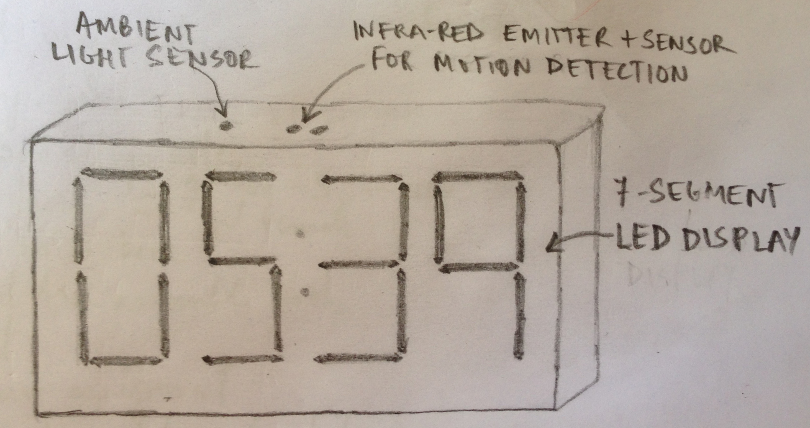

[Class Notes](http://academy.cba.mit.edu/classes/applications_implications/index.html)   

## Assignment

>  propose a final project that integrates the range of units covered:
> 
>  * what will it do?
>  * who's done what beforehand?
>  * what materials and components will be required?
>  * where will they come from?
>  * how much will it cost?
>  * what parts and systems will be made?
>  * what processes will be used?
>  * what tasks need to be completed?
>  * what questions need to be answered?
>  * what is the schedule?
>  * how will it be evaluated?
> 
>  projects can be separate or joint, but need to show individual mastery of all of the skills   
>  where possible, you should make rather than buy the parts of your project

## Hi! Time - Gesture Sensing Clock

As described in my [initial project proposal](w1-principles.html), I plan to build a gesture sensing clock. 

It is a clock, which:

* has an LED / LCD display
* displays the time normally in the day
* detects ambient light and turns off the display when its completely dark
* it detects gestures, maybe a waving hand, and switches on the display for a few seconds

The idea for this clock arose from a personal need. I like to sleep in pitch dark and in complete silence. Currently I have an 
 analog clock which audibly tick-tocks and even though it has flouroscent arms, is not visible to me without my specs in the dark.
 
Hi! Time would solve this problem. 

I also want make one with a distinctive, maybe even retro, look.  

## Prior Art

There are quite a few clocks which can project time onto a wall and recognize gestures. 

However, none of these turn-off the display when dark. Also most of these recognize gestures to turn on the projection 
    but the hand-motion has to be right above the clock. These can't detect gestures across the room.

Here are some similar products:

* Braun has a nicely designed [one](http://www.braun-clocks.com/clock/projection)
* There are [many](http://www.oregonscientificstore.com/c-16-projection-clocks.aspx) 
    [more](http://www.amazon.com/Best-Sellers-Home-Kitchen-Projection-Clocks/zgbs/home-garden/3734981) 
    [available](http://www.ebay.com/bhp/projection-clock)
* This is a [motion-detecting spy clock](http://www.amazon.com/TechTonic-Portable-Camera-Motion-Detection/dp/B00AY571XA) 
* [Wave Alarm](https://itunes.apple.com/app/wave-alarm-motion-control/id504386929?ls=1&mt=8) is an iPhone app which supports gestures

## Functional Specificatoin

The clock is made up of:

* LED display: 7-segment, 4 digits. 

* LED HourDigits and MinuteDigits separator - ":", which blinks every second.

* 3 buttons:
    * TimeSet: 
        * On pressing it, the HourDigits start blinking indicating it can be changed using the TimeUp and TimeDown buttons 
        * Pressing it again causes the MinuteDigits to start blinking
        * Pressing it again causes the blinking to stop and the time is updated   
    * TimeUp: 
        Increments the hour or minute (whichever is blinking)
    * TimeDown:
        Decrements the hour or minute

* Ambient light sensor

* PIR motion detection sensor

* Battery backup to retain time when disconnected from a wall-power outlet 
 
* Power cord with 3-pin plug for 5 amp sockets

* (Optional) Battery power indicator

### Use Cases

* When powered on, should display the clock at 12:00 
* When 

## Materials Required

