--- 

# Thu, May 12th 

Given the plan for the final project, which is documented on the [Applications & Implications page](w18-applications.html), I'm starting
prototyping some of the key pieces that are required for the clock.

The first is the Motion Detector. I need a way to detect a hand-wave about 1 foot above or in front of the clock.
  
However I like working outside-in, i.e. starting with the end product and working backwards to the details. Therefore, I'm starting off
    creating the design in Rhino.
    
## Digit Test Cuts 

First step was to design the digits and try out a test cut to get the tolerances correct for the acrylic segments to fit 
    into the craft plywood outlines. 
    
Here is the design in Rhino. 

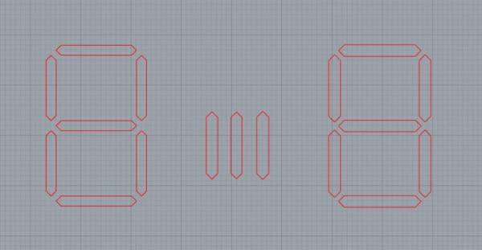

The original digit design is on the left, this is used for the plywood cut. 

The one on the right is used for the acrylic cut, it is increased in size by 1.15 mm (using Offset command).
 
The ones in the middle are the different sizes (0.1mm, 0.15mm, 0.2mm offset) to get the acrylic fit just right.

0.15mm increase had the best fit, here are the cut pieces:

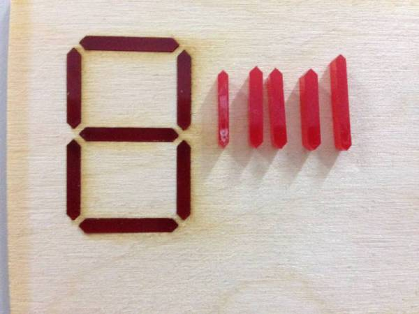

"2" being displayed with the test digit on the 7-segment board:

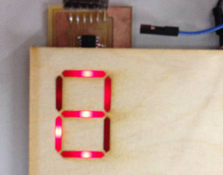

Looks like I might have to add 2 LEDs instead of 1 for each segment.

---

# Fri, May 13th 

Today I went to the local electronics market to buy a bunch of things I needed for the project. It turned out to be very 
    productive as I was able to get pretty much everything I needed:
    
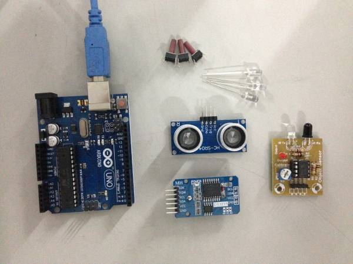

* RTC DS3231 module 
* HCSR04 Ultrasonic sensor module
* IR Transceiver
* Bright LEDs
* Arduino Uno for prototyping
* Jumper cables
* Push buttons with longer shaft

For motion detection I plan to try the ultrasonic sensor first since I want detection over at least 1+ ft, which the IR sensor isn't 
   capable of.
   
### Ultrasonic sensor test

As per the [datasheet](http://www.micropik.com/PDF/HCSR04.pdf) and [user-guide](https://www.mpja.com/download/hc-sr04_ultrasonic_module_user_guidejohn.pdf) 
    the sensor requires a 10µs pulse on it's Trigger pin, which causes it to send out 8 40khz sound pulses and waits for the echo back. 
    The distance to the object can be calculated by multiplying the time taken by the speed of sound. 
 
I used an Arduino sketch from [here](http://playground.arduino.cc/Code/NewPing).

<pre>
#include &lt;NewPing.h&gt;
 
#define TRIGGER_PIN  12
#define ECHO_PIN     11
#define MAX_DISTANCE 50
 
NewPing sonar(TRIGGER_PIN, ECHO_PIN, MAX_DISTANCE);
 
void setup() {
  Serial.begin(9600);
}
 
void loop() {
  delay(500);
  int uS = sonar.ping();
  Serial.print("Ping: ");
  Serial.print(uS / US_ROUNDTRIP_CM);
  Serial.println("cm");
}
</pre>
   
Here is a video showing the test: 

<video controls>
  <source src="images/w20-ultrasonic-test.mp4" type="video/mp4">
  Your browser does not support the video tag.
</video>

### Real Time Clock Test 

Next step is to test the RTC module. Here is the [DS3231 datasheet](https://datasheets.maximintegrated.com/en/ds/DS3231.pdf).

I used this [guide](http://tronixstuff.com/2014/12/01/tutorial-using-ds1307-and-ds3231-real-time-clock-modules-with-arduino/) and sketch
    to test the module. 
    
I hooked up the I2C SDA (data) and SCL (clock) to pins A4 and A5 respectively. 

Here's the sketch from the article:
 
<pre>
#include "Wire.h"
#define DS3231_I2C_ADDRESS 0x68
// Convert normal decimal numbers to binary coded decimal
byte decToBcd(byte val)
{
  return( (val/10*16) + (val%10) );
}
// Convert binary coded decimal to normal decimal numbers
byte bcdToDec(byte val)
{
  return( (val/16*10) + (val%16) );
}

void setDS3231time(byte second, byte minute, byte hour, byte dayOfWeek, byte
dayOfMonth, byte month, byte year)
{
  // sets time and date data to DS3231
  Wire.beginTransmission(DS3231_I2C_ADDRESS);
  Wire.write(0); // set next input to start at the seconds register
  Wire.write(decToBcd(second)); // set seconds
  Wire.write(decToBcd(minute)); // set minutes
  Wire.write(decToBcd(hour)); // set hours
  Wire.write(decToBcd(dayOfWeek)); // set day of week (1=Sunday, 7=Saturday)
  Wire.write(decToBcd(dayOfMonth)); // set date (1 to 31)
  Wire.write(decToBcd(month)); // set month
  Wire.write(decToBcd(year)); // set year (0 to 99)
  Wire.endTransmission();
}

void setup()
{
  Wire.begin();
  Serial.begin(9600);
  // set the initial time here:
  // DS3231 seconds, minutes, hours, day, date, month, year
  setDS3231time(0,14,20,6,13,5,16);
}

void readDS3231time(byte *second,
byte *minute,
byte *hour,
byte *dayOfWeek,
byte *dayOfMonth,
byte *month,
byte *year)
{
  Wire.beginTransmission(DS3231_I2C_ADDRESS);
  Wire.write(0); // set DS3231 register pointer to 00h
  Wire.endTransmission();
  Wire.requestFrom(DS3231_I2C_ADDRESS, 7);
  // request seven bytes of data from DS3231 starting from register 00h
  *second = bcdToDec(Wire.read() & 0x7f);
  *minute = bcdToDec(Wire.read());
  *hour = bcdToDec(Wire.read() & 0x3f);
  *dayOfWeek = bcdToDec(Wire.read());
  *dayOfMonth = bcdToDec(Wire.read());
  *month = bcdToDec(Wire.read());
  *year = bcdToDec(Wire.read());
}

void displayTime()
{
  byte second, minute, hour, dayOfWeek, dayOfMonth, month, year;
  // retrieve data from DS3231
  readDS3231time(&second, &minute, &hour, &dayOfWeek, &dayOfMonth, &month,
  &year);
  // send it to the serial monitor
  Serial.print(hour, DEC);
  // convert the byte variable to a decimal number when displayed
  Serial.print(":");
  if (minute<10)
  {
    Serial.print("0");
  }
  Serial.print(minute, DEC);
  Serial.print(":");
  if (second<10)
  {
    Serial.print("0");
  }
  Serial.print(second, DEC);
  Serial.print(" ");
  Serial.print(dayOfMonth, DEC);
  Serial.print("/");
  Serial.print(month, DEC);
  Serial.print("/");
  Serial.print(year, DEC);
  Serial.print(" Day of week: ");
  switch(dayOfWeek){
  case 1:
    Serial.println("Sunday");
    break;
  case 2:
    Serial.println("Monday");
    break;
  case 3:
    Serial.println("Tuesday");
    break;
  case 4:
    Serial.println("Wednesday");
    break;
  case 5:
    Serial.println("Thursday");
    break;
  case 6:
    Serial.println("Friday");
    break;
  case 7:
    Serial.println("Saturday");
    break;
  }
}
void loop()
{
  displayTime(); // display the real-time clock data on the Serial Monitor,
  delay(1000); // every second
}
</pre>

Most of the code is for formatting the time for display. The actual interaction is quite simple, and converts data between 
    [Binary Coded Decimal](https://en.wikipedia.org/wiki/Binary-coded_decimal) and Decimal. The RTC uses BCD for each part
     of the time (H:M:S, etc.).
      
Here is a video showing the test the time is printed out every second. 

<video controls>
  <source src="images/w20-rtc-test.mp4" type="video/mp4">
  Your browser does not support the video tag.
</video>

--- 

# Sat, May 14th 

Today I designed the cover for the clock in Rhino and did test cuts to get the press-fit tolerances and flexures correct. 
  
Here is the design for the testing press-fit tolerance. I kept one side constant and increased the size (using Offset command) of the other 
    pieces by 0.1 - 0.2 mm (The laser cutter has a kerf of 0.2 mm). 
   
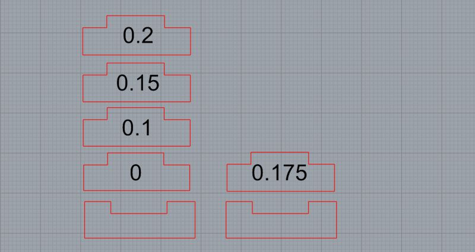

These are the test cuts. 0.175 had a good fit, I'll be going with 0.18. 
    
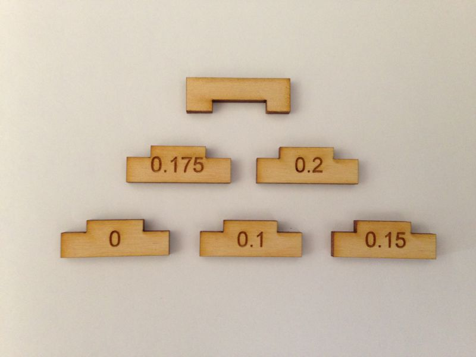

I have to remember to add chamfers to make it easier to slide the pieces in.

The flexures took longer than expected and I had to try a number of variations. Here is the design:

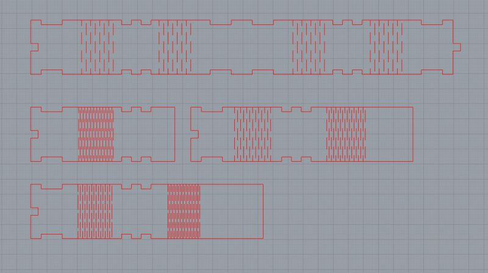

The one which worked best had 1 mm horizontal spacing and 2 mm gap between each vertical cut, which is the bottom right onw below:
 
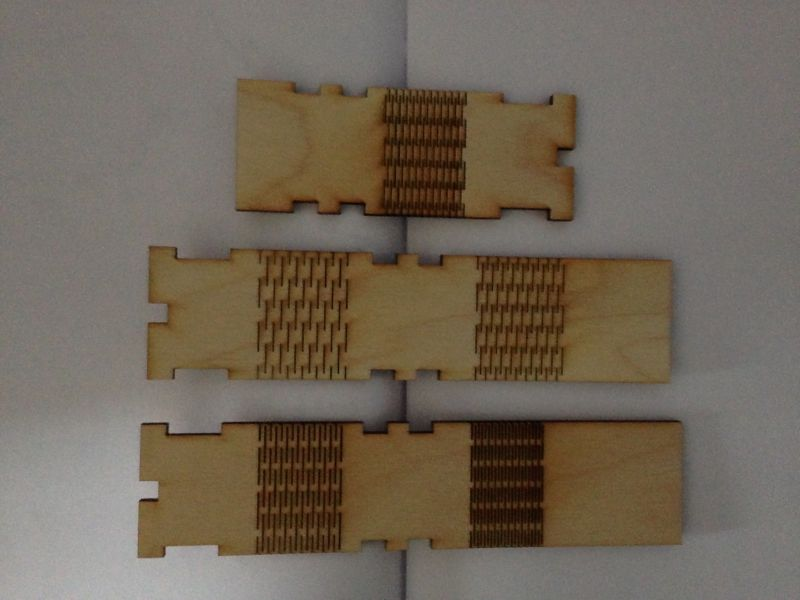

 --- 
 
# Sun, May 15th
  
Today my goal is to fabricate a digit board with the new bright LEDs I've bought.
 
I checked the voltage and current range for the LED using a DC power supply. 

At a steady current of 10mA, the LED is off at 1.4V and brightest at 2.2V. 

I was considering having 2 LEDs for each segment, but that significantly increases the effort to solder so many LEDs and
    resistors (if 2 LEDs for each segment are arranged in parallel with their own resistor). 
    
What I really want is a more diffused light coming from the LED. I found a neat [hack on Instructables](http://www.instructables.com/id/how-to-defuse-an-LED/?ALLSTEPS) 
    to do this by sandpapering the LED. 
    
Here is the sandpapered one next to a normal one:

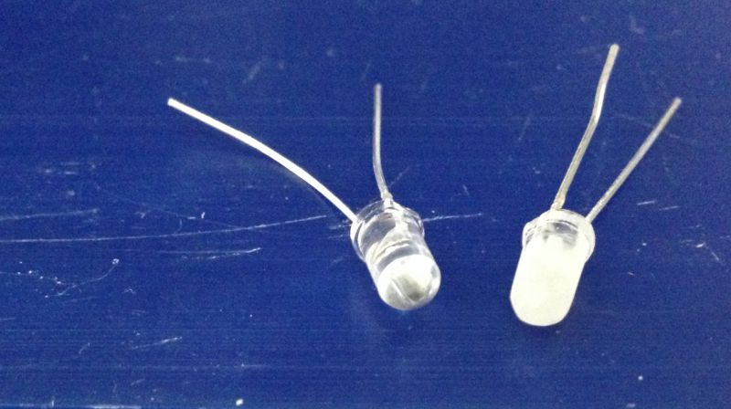

Here is the output of the 2 when connected to a power source with 2.1V and 10mA:

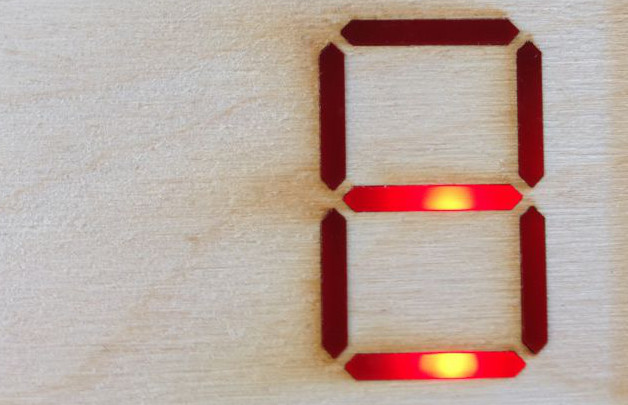 
    
The middle horizontal segment is the diffused one. The difference is not pronouned in the photo but the sandpapered one is 
    definitely diffusing the light.  

This is an excellent hack... it saves me a lot of time and effort!    
 
---
 
Next step is to fabricate the digit board with the new LEDs.

I plan to drill vias for the LED leads and solder them to the underside of the board. I don't 

I used the 7-segment board from the Output Devices week. However, I noticed that I had arranged the resistors and LEDs in the wrong
    order. The resistors should come before the LED, because otherwise the LED gets the full voltage rather than the divided voltage.  
    
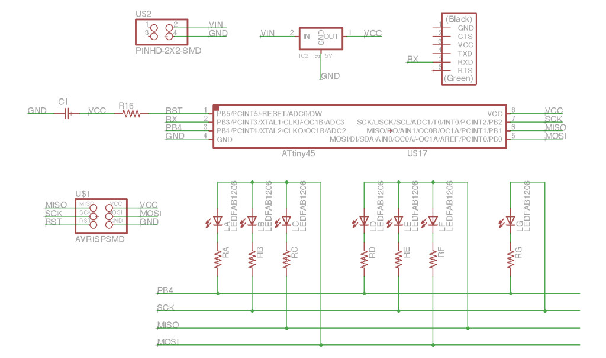

I changed the schematic to reflect this:

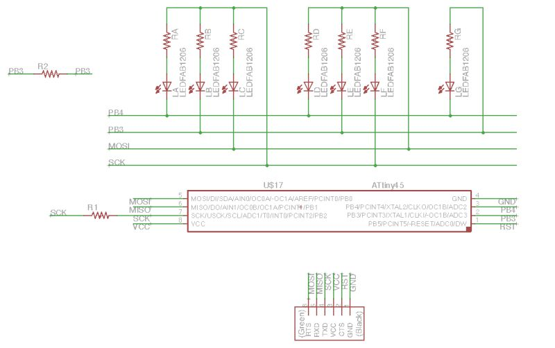

And created a new board layout. Routing traces took a few hours. I added vias for the LEDs and created the traces and outlines:
 
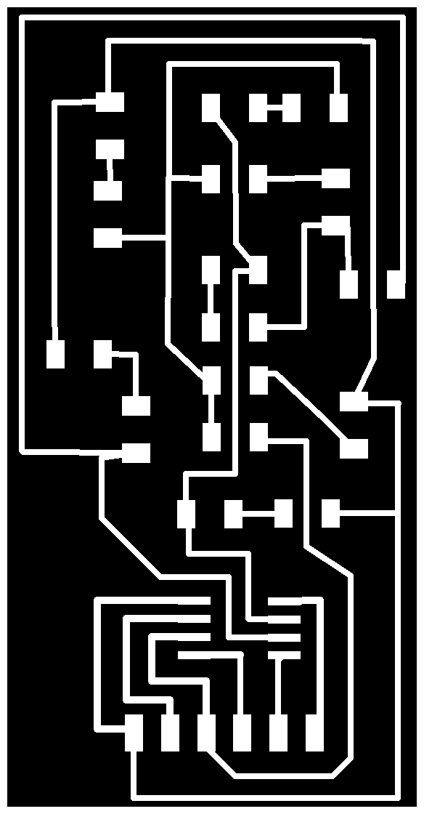 &nbsp; 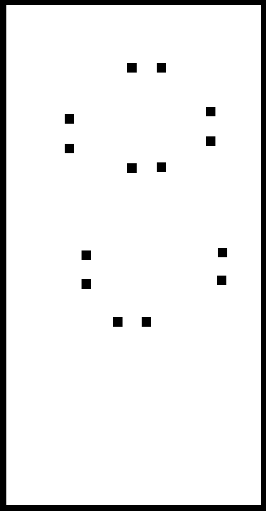

Here is the milled board:

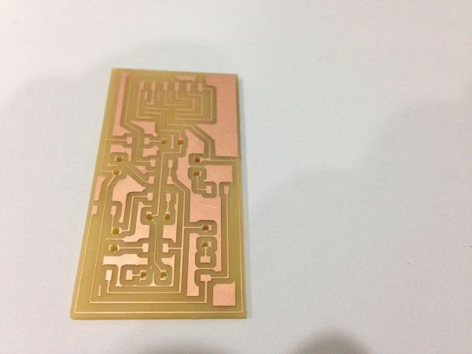

And here it is stuffed:

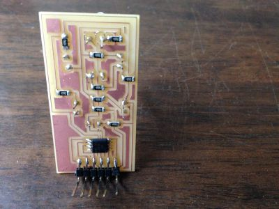 &nbsp; 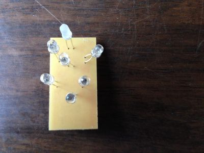

The through hole LED contacts aren't very strong and 1 of them snapped off. 

---

## Mon, 16th May

I headed back to Bangalore last night. Have to watch over my kids for the next 10 days since my wife is travelling.

I programmed the board with the 7segment and only 3 of them lit up... need to debug this.

I'm not liking the through-hole LED setup because it is not strong and can come loose quite easily. My idea with packing the 
    board LEDs close together was that I could bend their leads into place to form a wider 7-segment digit. I don't think thats
    going to work out too well.
    
I might use the surface mount LEDs as before.

The next step is to prototype the code for all the boards hooked up to a central Arduino and talking I2C amongst themselves. I will
    fabricate the remaining boards once I'm back in Trivandrum.
    

---

## Tue, 31th May

I'm back in Trivandrum. I have 4 days to complete my project and head back to Bangalore. Lots to do!
 
* Need to create a new board with bright LEDs mounted on the surface
    
    * Have to figure out the IDC header position on the 7-segment board so that it doesn't interfere with the LED position, which needs to be close to the clock surface   
        * Will mount the IDC header on the under-side as a through-hole component. Need to ensure the pads on the surface are large enough
        to create good contact with the pins.

    * I'm using an incorrect resistor of 499 ohms. Given 5V source voltage, 2V LED forward voltage if I use a 100 ohm resistor the current 
        through the LED would be 29mA, which is under the max of 30mA. Ideally it should be around 20mA but we only have a 100 ohm and 499 
        ohm resistor in the lab. 
    
* Need to figure out the power source and the voltage & current through each of the boards

    * 4 x 7-segment board
        * Each board with 7 LEDs, but these are multiplexed, so only 1 LED is on at a time for 1 ms.
        * Each LED requires 2.1 V and 20 mA
        * 4 x 20 mA == 80 mA

    * [Ambient light sensor](http://optekinc.com/datasheets/OP580DA.pdf)
        * 5V, 10mA

    * [DS3231 RTC module](http://www.elecrow.com/download/DS3231.pdf)
        * Active: 3.3 V - 5 V, 200 µA - 300 µA

    * HC SR04 - Ultrasonic module
        * 5V, 15 mA
       
    Given these requirements, the 7-segment LEDs would consume the most current. A 9V battery providing 1000mAh would last 
        for less than 12.5 hours (given 80 mA for 4 LEDs, see above)
          
    Therefore, an external power source would be needed. I will go with a 5V 2A DC adapter with a barrel jack or micro USB connector, since 
        these are easily available.
    
* Design the controller board

* Design and laser-cut the case

### 7-Segment Board Redesign
 
For the LED board, I realized that I2C won't work because I have only 1 spare pin on the ATtiny45. While I could reuse the RESET pin, it involves
    setting the RSTDISBL fuse and using a jumper when programming it. This seems needlessly complex. Instead I'll use a single-wire serial protocol - RS-232
    to communicate with all the boards. These anyways only read data from the master so a single wire should be sufficient.
    
I also aligned the LEDs on the board to the correct location using a set of wire guidelines.

I replaced the FTDI headers with an ISP header so that I can have a continuous strip of jumper cables with ISP connectors hanging off them
    which can connect the 4 7-Segment digits. 
 
I then routed the board, created many vias and have the PNGs ready for milling. This time I've added wider pads for the vias to provide a stronger contact with the
    LED leads.

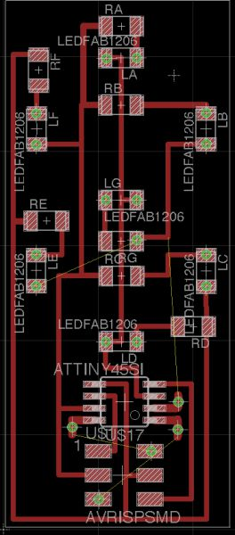 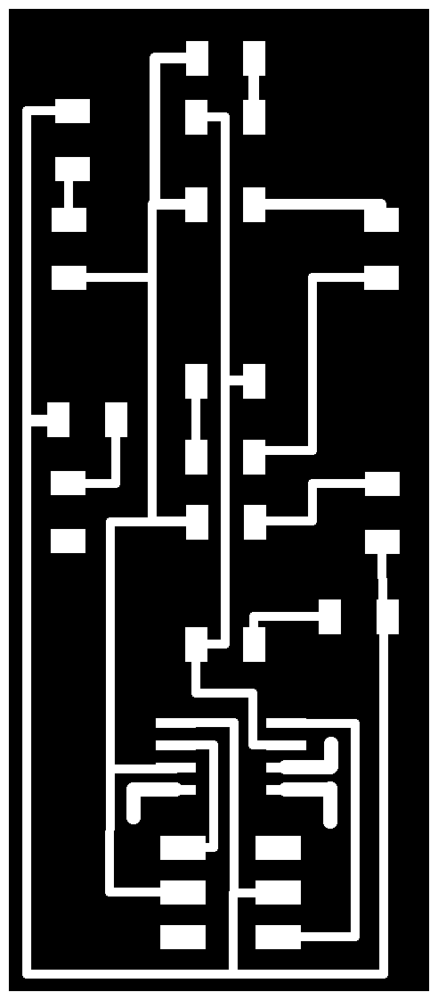 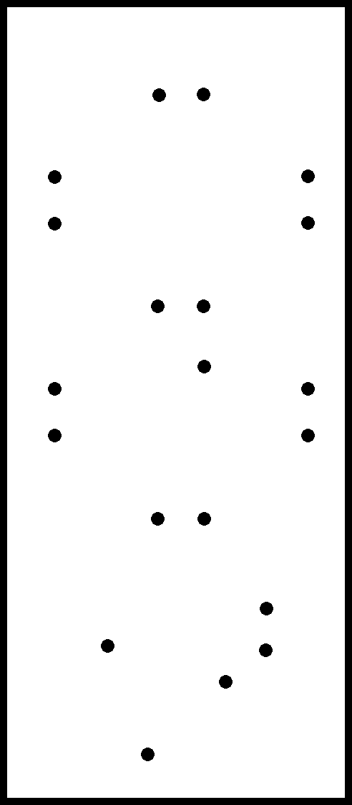

---

## Wed, 1st Jun

The traces are being milled right now.

Here is the board right after milling. Notice the bottom right corner has a trace that got cut when I was trying to pry out the board.

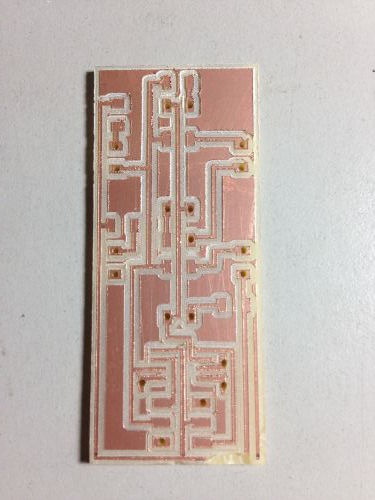

Stuffing the board took a few hours getting all the vias done.

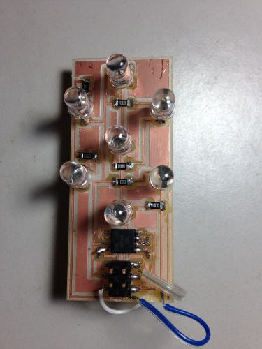 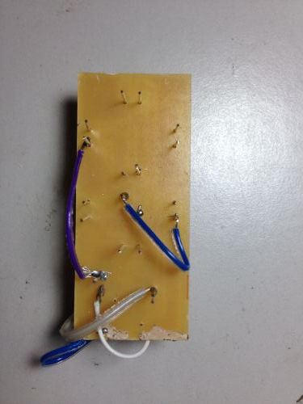

The wires look quite untidy and I'm concerned about shorts, will add some glue to hold the wires in place and provide some insulation. 

It did get programmed on the first shot. Here it is displaying each digit:

<video controls>
  <source src="images/w20-7segment-2-programmed.mp4" type="video/mp4">
  Your browser does not support the video tag.
</video>

It seems to work correctly only with 3.3V power. With 5V, multiple LEDs light up for each segment. I thought I'd got the voltage 
 calculations correct this time. 
 
Next step is to program it to accept inputs over single-wire serial interface.

### Serial Communication for 7-Segment Board

To test this I connected an Arduino Uno (which would act as the master) and the 7-segment board. I connected the TX pin on the Arduino to 
    the MISO (PB1) pin on the 7-segment.
    
I used Neil's sample code to check for data on the pin, read a character off it, and the display the digit. 

Here is the Arduino code, it mimics a clock sending a digit every sec:

<pre>
void setup() {
  // initialize both serial ports:
  Serial.begin(9600);
}

static int i = 0;
static int t = 0;
static int sleep = 10;

void loop() {
  Serial.write(i);
  delay(sleep);
  t = t + sleep;
  if (t >= 1000) {
    t = 0;
    i = ++i % 9;
  }
}
</pre>
    
I've been playing around with the 7segment code to get it to display digits sent over serial. The basic interaction worked fine. 
    Now I'm trying to get it to work using interrupts, because without them there is a visible flicker as the code waits for a start bit signal 
    on the serial line. This happens even if the wait is as small as 1 ms.
    
---

## Thu, 2nd Jun

Whats left to do before I leave on Sat:

* Get serial comm using interrupts working 
    * read up - 1, try small experiments: 2 hr
    
* Laser cut the case: 6 hr
    * case design with easily openable back cover
        * Rhino design:
            * add components and boards with exact dimensions to design
            * back cover with magnets
            * plywood placement guides for LEDs
            * shelves for board placement
            * position components: digit boards, hole for phototransistor, ultrasonic sensor, RTC
        * test cuts: 1 hr
    * final cut: 0.5 hr
    
* Controller board design: 6 hr
    * schematics: 2 hr
    * layout: 2 hr
    * milling & stuffing: 2 hr

* Mill and stuff 3 digits boards: 6 hr
    * 6 hrs: 3 x 2 hrs each
    
* Produce separator board (or connect it to the controller directly): 3 hr
 
* Program the controller: 3+ hr

What if I don't use buttons on the clock face for setting the time? These look clunky and I don't like the lack of tactile feedback 
    in capacitive buttons.
     
Instead what if time is set by connecting to a host over USB and sending it a serial command to set the time. The next version could 
    support a bluetooth interface. I like this approach better. 

### 7-Segment Single-Wire Serial Comms
 
NOTE TO SELF: When setting the clock prescaler, remember to update the makefile so that the F_CPU argument takes effect.
 
Wasted some precious time debugging this today!

Found an excellent article on [implementing UART in software on the ATtiny85](http://thegaragelab.com/a-software-uart-for-the-attiny85/).

Just discovered a big gotcha, that you have to use PCINT0_vect even if you are setting up an ISR for PCINT1. I checked the avr 
    header file iotnx5.h and confirmed that only PCINT0_vect is defined. There is no PCINT1_vect! Shouldn't the compiler have complained about this!?

[avr-libc page](http://www.nongnu.org/avr-libc/user-manual/group__avr__interrupts.html) says this:

> The ISR() macro cannot really spell-check the argument passed to them. Thus, by misspelling one of the names below in a 
> call to ISR(), a function will be created that, while possibly being usable as an interrupt function, is not actually 
> wired into the interrupt vector table. The compiler will generate a warning if it detects a suspiciously looking name of 
> a ISR() function (i.e. one that after macro replacement does not start with "__vector_").
  
So, your on your own if you misspell the vector. I tried with ISR(FOO) but got no compiler warning.

The following code works (snippet only, full code is in the original files linked below):

<pre>

volatile int i = 1;
 
ISR(PCINT0_vect) {     // Doesn't work if this is PCINT1_vect. 
   display(i++, 3000);
   i %= 9;
}

int main(void) {
    //
    // set clock divider to /1
    //
    CLKPR = (1 << CLKPCE);
    CLKPR = (0 << CLKPS3) | (0 << CLKPS2) | (0 << CLKPS1) | (0 << CLKPS0);
    
    DDRB &= (~ (1 << PB1));         // set serial-in pin to input
    PORTB |= (1 << PB1);            // ... and enable pull-up by driving it high
    
    GIMSK |= (1 << PCIE);           // enable pin change interrupt 
    PCMSK |= (1 << PCINT1);         // ... only for serial-in pin
    
    sei();                          // enable interrupts globally
    
    while(1) {
       ;
    }
    
    return 0;
}

</pre>