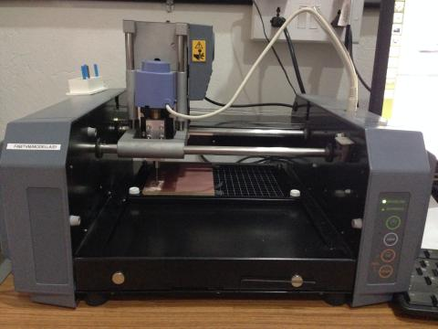
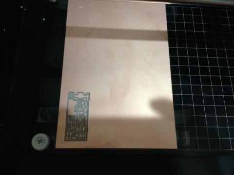
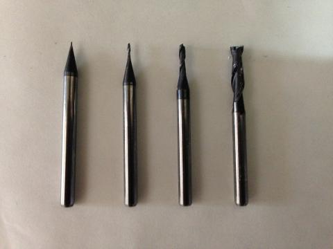
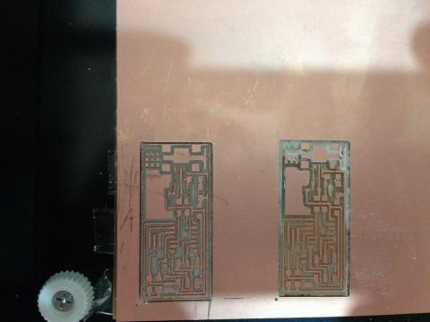
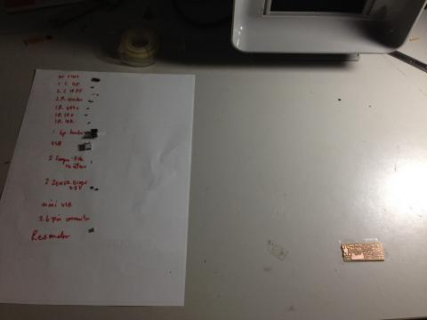
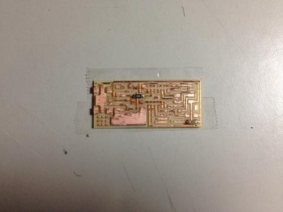
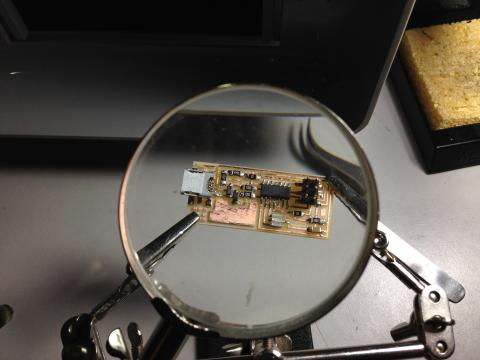
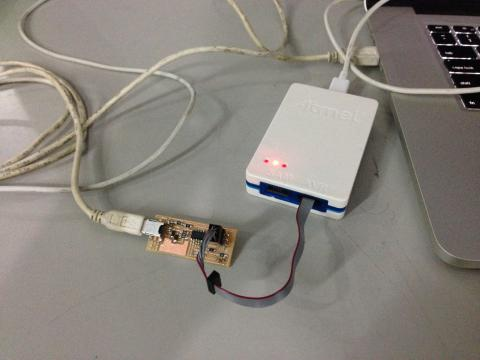

## [Assignment](http://academy.cba.mit.edu/classes/electronics_production/index.html)

> Make an in-circuit programmer

&nbsp;

---

&nbsp;

### Milling the Board

My first attempt did not work out well. I used the 1/32nd end-mill for cutting the traces instead of the 1/64th one.
 

Here is the board right after the job finished:

Here is a photo of different end-mills from 1/64th, 1/32nd, 1/16th and 1/8th, so that I don't mistake one for the other :-).

Here's the 2nd attempt. 

And this is final result after washing it with soap:

&nbsp;

---

&nbsp;

### Stuffing the Board

Here's the inital inventory:

This is after the first 2 components were soldered:

Here is the board strapped up: 

Here it is hooked up to another FabISP to be programmed: 

Here is the final ISP:

