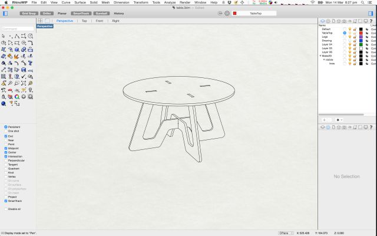
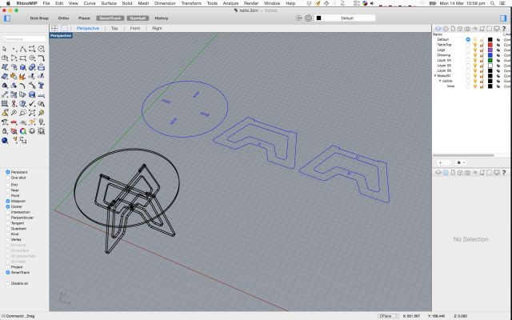
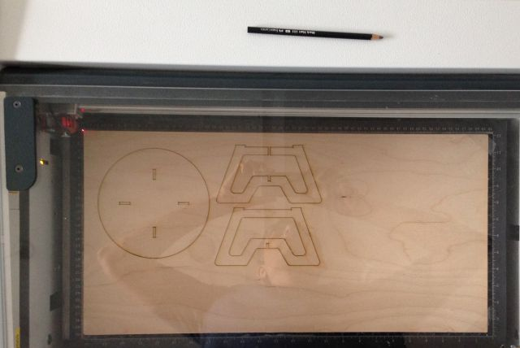
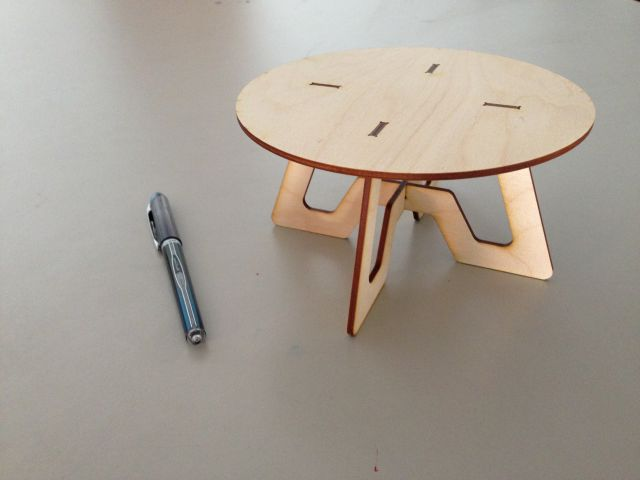

## [Assignment](http://academy.cba.mit.edu/classes/computer_machining/index.html)

> make something big!!   

&nbsp;

## Inspiration

Here are some great designs I came across:
 
* [Atfab](http://atfab.co/cnc-furniture/)
* [Opendesk](https://www.opendesk.cc/designs)
* [Italic shelf](www.ronen-kadushin.com/index.php/open-design/italic-shelf/)
* [Curved shelves](http://www.pedroterralab.com/open-source-furniture/)
* [Match table](http://supershape.org/Produktside_8.html)
* [Minimal waste table](http://design-milk.com/plus-table-by-fraaiheid/?utm_source=feedburner&utm_campaign=Feed:+design-milk+(Design+Milk))

## Design

I decided to build something similar to the Match table. 

Once I started designing in Rhino, I realized I needed to invest time understanding how to think in terms of Rhino's primitives. So
1 day was spent going through Rhino tutorials.

Here is the design in artistic mode:

Here are the wireframes:

### Original Files:

* Rhino model: [table.3dm.zip](files/table.3dm.zip) 

## Scaled down model

Next step is to laser cut a scaled down model using craft plywood (3mm). 

The original design was done with wood thickness assumed to be 6mm. So I needed to use Rhino's Scale function to scale 
it proportionately down by 50%.

Here is the table right after it was laser cut: 

Here is the assembled table:

## Test Machining Cut

## Final Print