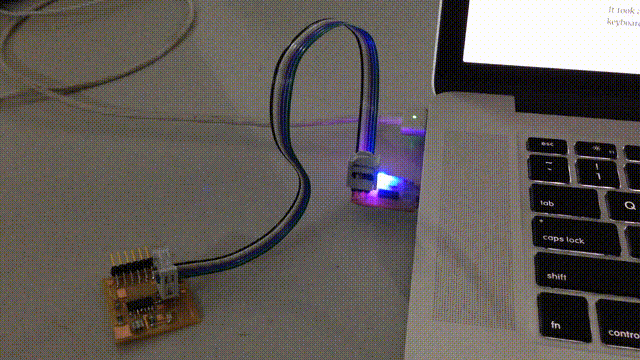
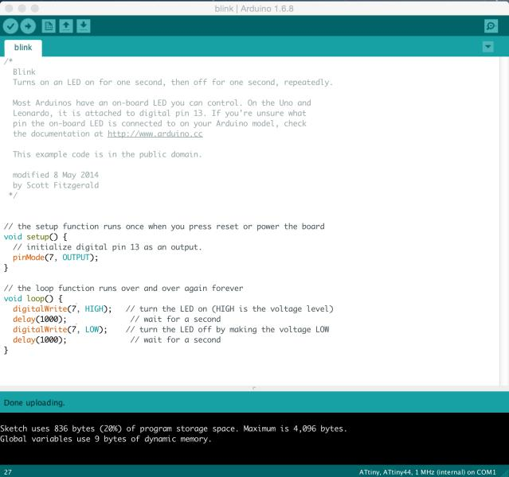
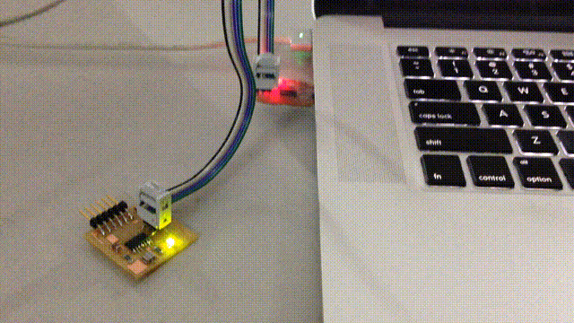
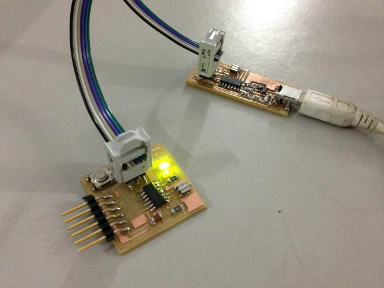

## [Assignment](http://academy.cba.mit.edu/classes/embedded_programming/index.html)

>* read a microcontroller data sheet   
>* program your board to do something, with as many different programming languages and programming environments as possible   

&nbsp;

## Program the board

First step was to check if the hello board from week 6 was working fine. 

I used a colleague's FabISP for this, since it was tried and tested.

I downloaded [Arduino IDE](https://www.arduino.cc/en/Main/Software), and followed the instructions 
[here](http://highlowtech.org/?p=1695) to setup [David Mellis']((https://github.com/damellis/attiny)) 
[Board Manager for the ATtiny](https://raw.githubusercontent.com/damellis/attiny/ide-1.6.x-boards-manager/package_damellis_attiny_index.json).
 
Then I opened up the Examples -> Blink sketch and changed the pin number for the LED from 13 to 6. I had connected the LED to 
 PA7 which was on pin 6. 
 
 When I uploaded the sketch, the LED on the FabISP started blinking instead of the one on the hello board:
  

I then changed the pin number to 7:
 

And it worked just fine! 

Next I tested it with my FabISP, and that worked fine too! :-)

Here it is:

### Original Files

* Blink sketch: [blink.ino](files/blink/blink.ino) 

## ATTiny Datasheet

The [datasheet](http://www.atmel.com/images/doc8006.pdf) covers ATtiny24 / 44 / 84. We're using the ATTiny44. 

* RISC - mostly single clock cycle execution instructions
* Speed - upto 20mhz at 4.5 - 5.5 V (upto 10mhz at 2.7 - 4.5 V)
* Low power mode
* 32 8bit registers
* 4K ISP flash
* 256b SRAM

* Bootloader
    * Flash divided into BootLoaderSection and ApplicationCodeSection. 
    * Code in BLS can  

* Clock signal: edge-triggered, value can be read or written only at clock-edge (rising or falling)
    clocked flip-flop, latch

* Multiplexer: data selector, selects 1 signal from many and forwards to its output n selector lines can have 2^n input signals

* datapath: 
    2 types of elements: combinational (ALU), state aka "sequential" logic components (memory, registers) 
    1 clock signal involves reading from a state element, maybe register, passing it through combinational logic and saving to a state element

* registers
    1 flip-flop per bit, clock signal, control signal
    on clock signal, check control and load in parallel from input or hold value

* pull-up resistor
    

### Questions

* "High performance" - is it? Comparisons? 
* Power consumption? Ampere-hours?
* "Fully static operation"?
* Pulse length
* 4-bit / 8-bit bi-directional IO port
* CMOS
* Timer with PWM channels?