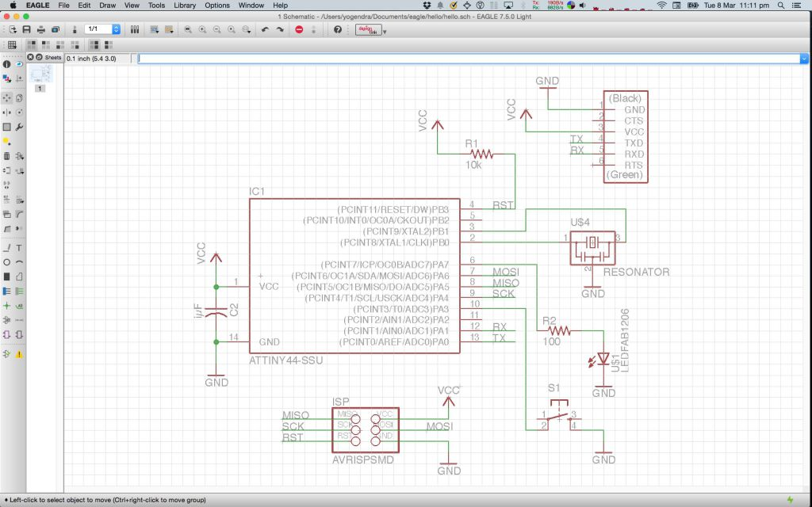
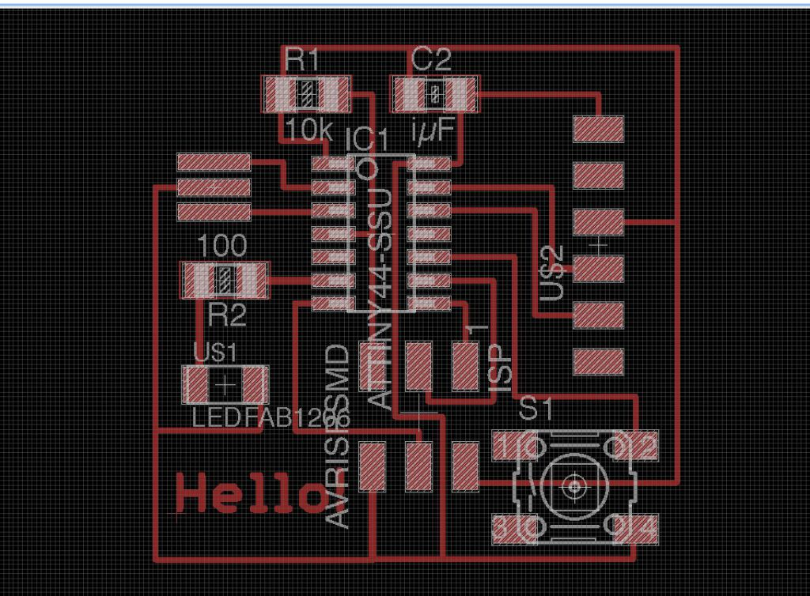

## [Assignment](http://academy.cba.mit.edu/classes/embedded_programming/index.html)

>* read a microcontroller data sheet   
>* program your board to do something, with as many different programming languages and programming environments as possible   

&nbsp;

## Program the board

### Hello LED!

First step was to check if the hello board from week 6 was working fine. 

I used a colleague's FabISP for this, since it was tried and tested.

I downloaded [Arduino IDE](https://www.arduino.cc/en/Main/Software), and followed the instructions 
[here](http://highlowtech.org/?p=1695) to setup [David Mellis']((https://github.com/damellis/attiny)) 
[Board Manager for the ATtiny](https://raw.githubusercontent.com/damellis/attiny/ide-1.6.x-boards-manager/package_damellis_attiny_index.json).
 
Then I opened up the Examples -> Blink sketch and changed the pin number for the LED from 13 to 6. I had connected the LED to 
 PA7 which was on pin 6. 
 
Here are the schematics and layout for the board from week 6 for reference:
   

 

 When I uploaded the sketch, the LED on the FabISP started blinking instead of the one on the hello board:
  

I then changed the pin number to 7:
 

And it worked just fine! 

Note the size of the binary in the above image shows 836 bytes. Will compare that to a C and assembly program later. 

Next I tested it with my FabISP, and that worked fine too! :-)

Here it is:

&nbsp;

### Button + LED

Next I tried the Button sketch. After programming, it was behaving unusually. The LED would turn on and off if I brought my finger close to 
  the LED. 
  
Francisco mentioned that this was because I hadn't enabled the pull-up resistor and the wire was "floating". 

[Arduino docs](https://www.arduino.cc/en/Tutorial/DigitalPins) mention that pinMode should be set to INPUT_PULLUP instead of 
    INPUT to enable the internal pull-up resistor. After changing this it worked correctly - with the LED being on by default
    because the signal was pulled-up to logical 1 and the code (below) uses this to switch on the LED. 
    
Here is the button sketch with my minor changes:
<pre>

const int buttonPin = 3;
const int ledPin =  7;

// variables will change:
int buttonState = 0;  

void setup() {
  // initialize the LED pin as an output:
  pinMode(ledPin, OUTPUT);
  // initialize the pushbutton pin as an input:
  pinMode(buttonPin, INPUT_PULLUP); // <----- changed from INPUT
}

void loop() {
  // read the state of the pushbutton value:
  buttonState = digitalRead(buttonPin);

  // check if the pushbutton is pressed.
  // if it is, the buttonState is HIGH:
  if (buttonState == HIGH) {
    // turn LED on:
    digitalWrite(ledPin, HIGH);
  } else {
    // turn LED off:
    digitalWrite(ledPin, LOW);
  }
}
</pre>

&nbsp;

### C LED program

Next I want to write the LED blink program in C. 

I have started reading [Make: AVR Programming](http://www.amazon.com/AVR-Programming-Learning-Software-Hardware/dp/1449355781) by
   Elliot Williams, and I really like this book compared to the couple of others on AVR programming I've tried to read. 
    
I used the Makefile generated from avr-project, which is a Crosspack AVR tool available on the Mac. 
 
Next I tried to compile some sample code from his [github book repo](https://github.com/hexagon5un/AVR-Programming).

 
<pre>
#include <avr/io.h>
#include <util/delay.h>

int main(void) {
    DDRB |= (1 << PB0);
    
    while(1) {
        PORTB = 0b00000001;
        _delay_ms(1000);
        
        PORTB = 0b0000000;
        _delay_ms(1000);
    }

    return 0;
}
</pre>
 
This output the following: 
 
<pre>
avr-gcc -Wall -Os -DF_CPU=20000000 -mmcu=attiny44 -c blink.c -o blink.o
avr-gcc -Wall -Os -DF_CPU=20000000 -mmcu=attiny44 -o blink.elf blink.o
rm -f blink.hex
avr-objcopy -j .text -j .data -O ihex blink.elf blink.hex
avr-size --format=avr --mcu=attiny44 blink.elf
AVR Memory Usage
----------------
Device: attiny44

Program:     102 bytes (2.5% Full)
(.text + .data + .bootloader)

Data:          0 bytes (0.0% Full)
(.data + .bss + .noinit)

</pre>

It shows that the program size is 102 bytes, which is much smaller than the one generated through the Arduino Sketch (836 bytes).  

### Original Files

* blink sketch: [blink.ino](files/w8/blink/blink.ino) 
* button sketch: [button.ino](files/w8/button/button.ino) 

## ATTiny44 Datasheet

The [datasheet](http://www.atmel.com/images/doc8006.pdf) covers ATtiny24 / 44 / 84. We're using the ATTiny44. 

* RISC - mostly single clock cycle execution instructions
* Speed - upto 20mhz at 4.5 - 5.5 V (upto 10mhz at 2.7 - 4.5 V)
* Low power mode
* 32 8bit registers
* 4K ISP flash
* 256b SRAM

* Bootloader
    * Flash divided into BootLoaderSection and ApplicationCodeSection. 
    * Code in BLS can  

### Notes

* Clock signal: edge-triggered, value can be read or written only at clock-edge (rising or falling)
    clocked flip-flop, latch

* Multiplexer: data selector, selects 1 signal from many and forwards to its output n selector lines can have 2^n input signals

* Datapath: 
    2 types of elements: combinational (ALU), state aka "sequential" logic components (memory, registers) 
    1 clock signal involves reading from a state element, maybe register, passing it through combinational logic and saving to a state element

* Registers
    1 flip-flop per bit, clock signal, control signal
    on clock signal, check control and load in parallel from input or hold value

* Pull-up resistor

* Global Interrupt Enable bit is automatically set to one after the Return from Interrupt instruction is executed. 

### Questions

* "High performance" - is it? Comparisons? 
* Power consumption? Ampere-hours?
* "Fully static operation"?
* Pulse length
* 4-bit / 8-bit bi-directional IO port
* CMOS
* Timer with PWM channels?
* "selected clock source for the chip"
* Fuse?

## Todo
 
* Assembly
* C
* Javascript
* Python
* Understand avrdude
* Serial comm
* Datasheet
* Interrupt to respond to switch, while waiting in low power mode

* Compare size of C, assembly, arduino binary size 

